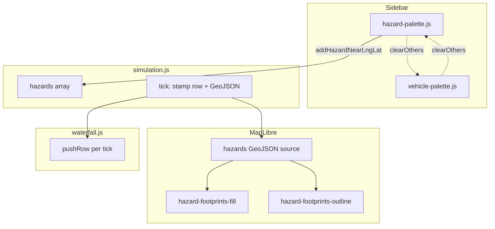

# Roadway hazards — developer & agent handoff

This document describes **how roadway hazards are modeled, rendered, and coupled to the waterfall** in this app. It is written for **future maintainers and autonomous agents** extending the feature beyond V1.

For the broader traffic/waterfall/map architecture, see [`waterfall-traffic-rebuild.md`](waterfall-traffic-rebuild.md). For product scope, see [`../Scope/Scope.md`](../Scope/Scope.md).

---

## 1. What V1 does (product summary)

Users can place **three hazard kinds**: **vehicle crash**, **rock slide**, and **avalanche**. Each has a **size tier**: **small**, **medium**, or **large**.

- **Map**: Hazards appear as **semi-transparent corridor polygons** draped on the basemap. Geometry is **aligned to the road centerline** (same snapping philosophy as vehicles). Rock slides and avalanches use **asymmetric lateral width** (wider on one side of travel) to suggest mass coming from the “upslope” side without terrain analysis.
- **Waterfall**: Each hazard contributes **broad horizontal energy** across a span of **fiber channels** for every simulation tick, with **tier-dependent amplitude** and **deterministic-looking jitter** (phase + randomness per tick).
- **Lifecycle**: Hazards are **persistent** until the user hits **Clear** or the simulation `start()` resets state (page load path). There is **no TTL decay** in V1.

---

## 2. Mental model

**Coupling axis**: Like vehicles, hazards ultimately map to **channel indices** (`startChannel` … `endChannel`) so the waterfall stays index-aligned with `fiber_channels.json`.

---

## 3. Source files (ownership)

| File | Responsibility |
|------|----------------|
| [`src/hazard-model.js`](../src/hazard-model.js) | Kind/size normalization, **footprint dimensions** (length + left/right lateral meters), **RGBA colors**, **`buildCorridorPolygonLonLat`**, **`hazardPeakIntensity`**, fallback channel half-width when road geometry is missing |
| [`src/hazard-palette.js`](../src/hazard-palette.js) | UI flow: pick hazard kind → optional size → **tap/click map** to place; consumes clicks before vehicle palette; respects `VEHICLE_HIT_LAYERS` so clicks on vehicles cancel pending hazard placement |
| [`src/simulation.js`](../src/simulation.js) | **`hazards[]`**, **`addHazardNearLngLat`**, channel span from road distance window, **waterfall stamping loop** for hazards, **GeoJSON feature build** for map, `clearFleet` / `start` reset |
| [`src/map-core.js`](../src/map-core.js) | **`updateMapHazards(map, features)`** — pushes GeoJSON into the `hazards` source |
| [`src/map.js`](../src/map.js) | **`addHazardLayers`** — registers `hazards` source and fill + line layers (**below** vehicle extrusions in layer order) |
| [`src/main.js`](../src/main.js) | Wires **`createHazardPalette`** + **`createVehiclePalette`** with **`clearOthers`** mutual exclusion; **`tryConsumeMapClick`** runs **hazard first**, then vehicle placement |
| [`src/vehicle-palette.js`](../src/vehicle-palette.js) | Optional **`clearOthers`** when arming vehicle placement (drag / tap-to-place) |
| [`src/ui.js`](../src/ui.js) | Stats card **Hazards** count (`stat-anomalies` element id is legacy; label reads “Hazards”) |
| [`test/hazard-model.test.js`](../test/hazard-model.test.js) | Unit tests for normalization, footprint scaling, closed rings |

---

## 4. Hazard object shape (runtime)

Created in `addHazardNearLngLat` and pushed to `hazards`. Fields agents rely on:

| Field | Meaning |
|-------|---------|
| `id` | Stable display id, e.g. `HZD-0001` (monotonic `nextHazardSeq`) |
| `kind` | `'crash' \| 'rock_slide' \| 'avalanche'` |
| `size` | `'small' \| 'medium' \| 'large'` |
| `peakIntensity` | 0–1 scale for waterfall stamping (`hazardPeakIntensity`) |
| `phase` | Random phase for spatial jitter along channels |
| `startChannel`, `endChannel` | Inclusive span on the waterfall axis |
| `geometry` | GeoJSON **`Polygon`** in WGS84 for map layers |
| `laneKey`, `roadDistM` | Present when **road motion model** is available |

---

## 5. Geometry & snapping

### Road-available path (`roadOk`)

1. Snap click to nearest lane with **`nearestPointOnLanes`** / **`nearestPointOnLanesPrefer`** (same **LAB_SNAP_MAX_M** window as vehicles).
2. Read **`travelBearingDegAtRoadDistance`** for travel direction (`directionForLane` → `up_canyon` / `down_canyon`).
3. **`lateralWidthsForHazard`** applies **`UPSLOPE_ON_LEFT_OF_TRAVEL`** so rock slide / avalanche swap left/right when the heuristic is inverted.
4. **`buildCorridorPolygonLonLat`** builds a **rectangle**: half-length along road × asymmetric lateral offsets using the same local tangent plane approximation as vehicle footprints.

### Legacy fiber-only path

When lane geometry is unavailable, the code snaps to the **nearest fiber channel** and uses **`hazardFallbackChannelHalfWidth(size)`** for channel span; bearing comes from **adjacent channel samples**.

---

## 6. Map layers (MapLibre)

| Layer id | Type | Source | Notes |
|----------|------|--------|------|
| `hazard-footprints-fill` | `fill` | `hazards` | `fill-color` ← `fill_color` property |
| `hazard-footprints-outline` | `line` | `hazards` | `line-color` ← `outline_color` property |

Feature **properties** include `id`, `kind`, `size`, `milepost`, `fill_color`, `outline_color`.

**Removed in V1**: older **`anomalies`** circle/pulse layers — replaced entirely by polygon hazards.

---

## 7. Waterfall stamping

Inside the tick loop, after ambient noise and vehicle stamps, hazards iterate:

- For each channel `i` in `[startChannel, endChannel]`, add energy proportional to **`peakIntensity`**, with **`spatialVar`** (sin + phase) and **`temporalVar`** (random per tick), matching the previous anomaly-band style.

To **retune** “how hazards look” on the waterfall, edit:

- [`hazardPeakIntensity`](../src/hazard-model.js) for tier scaling.
- The inner loop in [`simulation.js`](../src/simulation.js) (search `for (const h of hazards)`).

---

## 8. Extension recipes (for agents)

### Add a new hazard kind

1. Extend **`HAZARD_KINDS`** and **`normalizeHazardKind`** in `hazard-model.js`.
2. Add footprint rules in **`hazardFootprintMeters`** / **`lateralWidthsForHazard`**.
3. Add colors in **`hazardPalette`** (RGBA strings).
4. Add a **palette button** in [`index.html`](../index.html) (`data-hazard-kind="..."`).
5. Optionally extend **`hazardPeakIntensity`**.
6. Add/adjust tests in **`test/hazard-model.test.js`**.

### Per-hazard delete or selection

V1 has **no** `removeHazard(id)` or map click-select on hazard layers. **`VECTOR_HIT_LAYERS`** in `map-constants.js` currently lists **vehicle** layers only. To support hazard interaction:

- Add hazard layer ids to a hit-test list (similar to **`VEHICLE_HIT_LAYERS`** for vehicles).
- Extend **`setupTrafficSimulatorMapInteractions`** in `map.js` (or parallel handler).
- Filter **`hazards`** in `simulation.js` and call **`updateMapHazards`**.

### DEM-based upslope direction

Replace **`UPSLOPE_ON_LEFT_OF_TRAVEL`** with slope from **terrain** (MapLibre queryTerrainElevation or Terrarium decode at hazard anchor). Compute which lateral side is uphill and map that to **left/right widths**.

### Match real waterfall screenshots

Keep **`hazardPeakIntensity`** and the **`spatialVar` / `temporalVar`** mix in simulation aligned with reference captures; consider **kind-specific** modulation (e.g., smoother blob for avalanche vs. spikier for rock).

---

## 9. Tests & verification

| Command | Scope |
|---------|--------|
| `npm test` | Includes `test/hazard-model.test.js` |
| `npm run lint` | ESLint on `src/` |

After changing hazard geometry or stamping, run **`npm test`** and manually smoke-test **place hazard → map polygon + waterfall band**.

---

## 10. Known limitations (intentional V1)

- **No per-hazard removal**; **Clear** wipes entire fleet + hazards.
- **No animation** of debris; footprint is static GeoJSON.
- **Upslope side** is a **constant heuristic**, not DEM-derived.
- **Order of click handlers**: hazard palette consumes first; vehicle palette second (`main.js`).

---

## 11. Related historical context

This repo had experimental **Deck.gl / hex** hazard prototypes on other branches; **current `main` uses MapLibre-native fill + line** only. When searching git history, prefer this document and `hazard-model.js` over older deck-based implementations unless explicitly resurrecting that stack.
