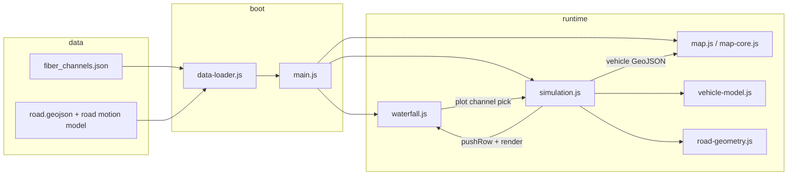

# Waterfall, traffic simulation, and map — rebuild guide

This document describes how the **DAS-style waterfall**, **vehicle simulation**, and **map** fit together in this app. Use it when fixing bugs, replacing implementations, or onboarding—so behavior stays consistent without rediscovering details from scattered comments.

For product scope and domain background, see `Scope/Scope.md`. For GIS preprocessing, see `README.md` and `data/raw/README.md`.

---

## 1. Mental model

- **Horizontal axis (channels)** — Discrete samples along the fiber (`fiber_channels.json`). Spacing is **2 m** between channels; channel index increases along the fiber chainage used internally.
- **Vertical axis (time)** — **Newest row at the top**, older rows below (classic waterfall). Each **simulation tick** appends one row (`TICK_MS` in `src/simulation.js`, currently **100 ms**).
- **Brightness / color** — Strain-rate is **not** real DAS data here; it is a **synthetic scalar field** per channel built each tick from ambient noise plus **vehicle stamps**. The canvas maps scalar → **jet-like LUT** with a **fixed value range** so noise stays dark blue and vehicles read green → yellow → warm tones.

The map and waterfall are **coupled by channel index**: picking a channel on the plot flies the map to that channel’s lon/lat; selecting a vehicle scrolls/highlights the corresponding channel.

**Roadway hazards** (crash, rock slide, avalanche) reuse the same channel axis: each hazard stamps a span of channels each tick and renders a lane-aligned polygon on the map. See [`hazards.md`](hazards.md).

---

## 2. Architecture (data flow)



**Boot order** (`src/main.js`): load data → `initMap` → `initWaterfall` → `createSimulation(data, { map, waterfall, ui })` → wire `waterfall.setPlotChannelPickCallback` to `sim.focusMapOnChannel` → `sim.start()`.

---

## 3. Source files (ownership)

| File | Responsibility |
|------|----------------|
| `src/main.js` | Boots app, responsive layout, demo fleet buttons, connects waterfall pick → map focus |
| `src/simulation.js` | Tick loop, IDM traffic, **hazard channel stamps**, road vs legacy fiber paths, **row assembly** (`Float32Array` per channel), `pushRow` / highlight / track channel |
| `src/waterfall.js` | Ring buffer history, **jet LUT**, scaling/gamma, **max pooling** across channels when zoomed out, pan/zoom/pick, highlight band overlay |
| `src/vehicle-model.js` | Vehicle specs: physics lengths, **DAS half-width and strength per class**, map footprint scaling |
| `src/road-geometry.js` | Road distance ↔ channel position, bearings, curvature, lane routing |
| `src/map.js` / `src/map-core.js` | MapLibre layers, **hazard** fill/line GeoJSON, vehicle fill-extrusion features, interaction hooks |
| `src/ui.js` | Sidebar stats cards and fleet UI |

---

## 4. Constants that define “how it looks”

These are the main knobs if traces look wrong (too faint, wrong slope, washed out).

| Concept | Where | Notes |
|---------|--------|------|
| Channel spacing | `CHANNEL_SPACING_M = 2` in `simulation.js` | Tied to preprocessing (2 m samples) |
| Tick / row period | `TICK_MS = 100` | One waterfall row per tick |
| History depth | `HISTORY_ROWS = 256` in `waterfall.js` | ~25.6 s of history at 100 ms/tick |
| Jet LUT | Built once in `waterfall.js` | 512-entry RGB tables `JET_R/G/B` |
| Display range | `vmin = 0`, `vmax = 1.02`, `gamma = 0.91` in `render()` | Fixed range avoids percentile stretch washing out noise |
| Zoomed-out sampling | `render()` loop | When many channels map to one pixel, takes **max** across span so thin traces survive |
| Vehicle footprint (DAS) | `VEHICLE_SPECS[*].dasHalfWidthCh`, `dasStrength` | Wider/heavier classes → wider, hotter traces |
| Speed → amplitude | `simulation.js` stamp loop | `speedNorm`, `speedCoupling` scale peak strength with mph |

---

## 5. Simulation row pipeline (one tick)

1. **Ambient row** — Per-channel bias (`channelBias` from waterfall + coupling) plus evolving `noiseState` and sinusoidal/spatial terms so the background stays in the **low jet band**.
2. **Vehicles** — For each vehicle, compute **peak strength** from class, speed, and small deterministic ripple (+ small random jitter). Stamp energy with `stampVehicleEnergyAt` (quadratic falloff in channel distance).
3. **Motion stitching** — `planVehicleWaterfallStamps` may place **multiple micro-stamps** along prev→current fiber motion so fast motion does not collapse to a single centroid (avoids “dead cyan” band). If `isFiberMappingGlitch` fires (implausible fiber jump vs road motion), falls back to a **single** stamp at raw position.
4. **Anomalies** — Optional bands add energy on channel ranges.
5. **Output** — `targets.waterfall.pushRow(row)` then `render()`.
6. **Selection overlay** — `setHighlightChannel` / `setTrackChannel` for selected vehicle or plot-focus channel.

**Dual physics paths**: If road geometry validates (`roadOk`), vehicles follow **lanes** with `roadDistanceToChannelPos`, clamping, IDM, etc. Otherwise a **legacy** path indexes fiber by distance along channel spacing only. Changes to motion almost always need checking **both** branches.

---

## 6. Map ↔ waterfall coupling

| Direction | Behavior |
|-----------|-----------|
| User clicks waterfall | Deferred pick (`schedulePlotChannelPick`) → zoom slightly toward channel → `plotChannelPickCallback(channelIndex)` → `sim.focusMapOnChannel` → map `easeTo` channel lon/lat; waterfall sets **plot focus** highlight |
| User selects vehicle in UI | `setSelectedVehicleId` → waterfall `zoomChannelIntoView`, highlight + **track** channel; map flies to vehicle |
| Waterfall tracking | `setTrackChannel` + `scrollTrackChannelIntoView` keeps the vehicle column in view when zoomed |

Exported simulation API includes `focusMapOnChannel` (see `createSimulation` return object in `simulation.js`).

---

## 7. Exported helpers (for tests and tooling)

These pure functions are safe to unit test without a browser:

- `planVehicleWaterfallStamps`, `isFiberMappingGlitch`, `waterfallStitchSpanBudget` — `simulation.js`
- `collectCrossingChannelIndices` — `waterfall.js`

---

## 8. Verification and tests

### Unit tests (Vitest)

```bash
npm test
# or during development
npm run test:watch
```

**Tests live in `test/`**, including:

- `waterfall-crossings.test.js`, `waterfall-stitch-budget.test.js`, `waterfall-motion-stamp-plan.test.js`
- `mapping-glitch.test.js`, `simulation.test.js` (data integrity + placeholders)
- `vehicle-model.test.js`, `traffic-follow.test.js`, `road-geometry.test.js`, etc.

When changing stamp logic or vehicle DAS parameters, extend or add tests next to these files.

### Headless browser checks (after build)

These scripts start `vite preview`, drive **Chrome** via Puppeteer, and assert basic health. They require a Chromium/Chrome binary (see env vars below).

```bash
npm run verify:map      # Splash dismiss → MapLibre canvas visible
npm run verify:waterfall  # Demo fleet run → waterfall canvas has warm (vehicle) pixels
```

| Env var | Purpose |
|---------|---------|
| `CHROME_PATH` / `PUPPETEER_EXECUTABLE_PATH` | Path to Chrome/Chromium |
| `VERIFY_PREVIEW_PORT` | Port for map verify (default 4177) |
| `VERIFY_WATERFALL_PORT` | Port for waterfall verify (default 4178) |
| `CURSOR_ARTIFACT_DIR` | Optional; waterfall script may save `verify-waterfall.png` |

**Typical CI/Linux**: install Chromium (e.g. `google-chrome-stable` or `chromium-browser`) and set `CHROME_PATH` to its executable.

---

## 9. Rebuild checklist (if you replace major pieces)

1. **Data** — Regenerate or validate `fiber_channels.json` (monotonic `fiber_distance_m`, sequential `channel_id`). See `test/simulation.test.js` “Preprocessed data integrity”.
2. **Constants** — Align `CHANNEL_SPACING_M`, `TICK_MS`, and preprocessing step with `README.md` / `simulation.js`.
3. **Row contract** — Each tick produces `Float32Array` length `channels.length`, values roughly in `[0, 1]` before render (render clamps to `vmax`).
4. **Waterfall render** — Preserve fixed vmin/vmax/gamma unless intentionally changing the visual language; preserve max-pooling when zoomed out or traces disappear.
5. **Stamp planner** — Keep glitch guard + stitch rules or update `planVehicleWaterfallStamps` tests.
6. **Map** — Vehicle features must stay in sync with `channelPos` / lon/lat from the same tick order as `pushRow`.
7. **Run** — `npm run build && npm test && npm run verify:waterfall` (and `verify:map`).

---

## 10. Known fragility (for future you)

- **Randomness** in row generation (`Math.random()` in noise and peak jitter) makes **pixel-identical** golden screenshots unstable without a seeded RNG or test hook.
- **`verify:waterfall`** uses time delays; slow machines may need longer waits if checks flake.
- **Crossing guides** — Logic exists (`collectCrossingChannelIndices`); default waterfall drawing keeps crossings subtle/disabled for clarity (see comments in `waterfall.js` render).

---

*Last aligned with source layout and scripts in-repo; when you change critical constants or file roles, update this doc in the same PR.*
